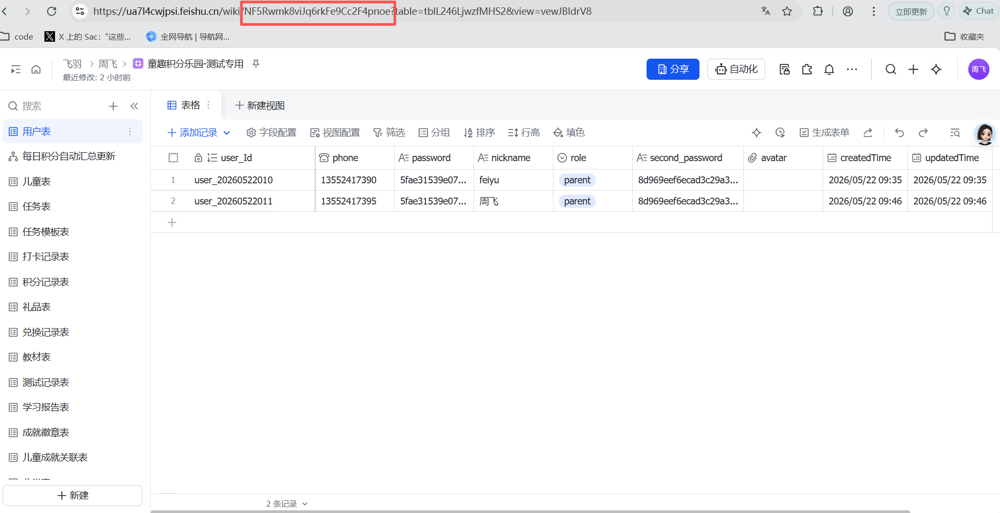
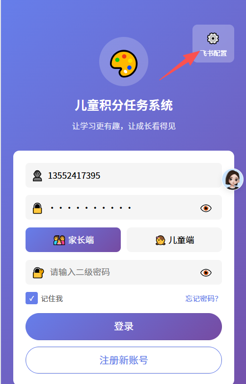
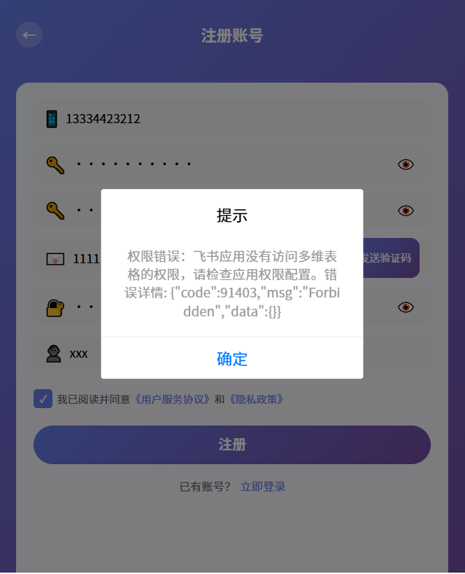

【学习工作赛道】童趣乐园 - 让成长更有动力

【标签】学习工作

## 一、创意名称 + 创意介绍

**创意名称**：童趣乐园

**想解决什么问题**：家长难以有效激励孩子养成良好习惯、完成学习任务，缺乏系统化的奖励机制和数据追踪手段；同时缺乏AI辅助批改和个性化学习建议功能。

**为什么会想到做这个**：在家庭教育中发现，单纯的说教难以激发孩子的积极性，而游戏化的积分奖励机制能够有效提高孩子的参与度和成就感。同时，AI技术的发展为个性化学习辅导提供了可能。

**大概是什么产品**：一个基于 UniApp 开发的跨平台小程序，包含家长端和儿童端，通过任务发布、积分奖励、连续打卡、AI批改等功能，帮助家长科学管理孩子的学习和生活习惯。

## 二、目标用户及痛点

**面向哪些用户**：
- **核心用户**：5-12岁儿童及其家长

**在什么场景下使用**：
- 家庭场景：家长为孩子布置日常学习任务、家务劳动
- 教育场景：老师布置课后作业、学习打卡任务
- 活动场景：假期实践活动、亲子互动任务

**当前痛点**：
1. 家长缺乏有效工具追踪孩子任务完成情况，全靠口头提醒
2. 奖励机制不透明，孩子缺乏成就感和持续动力
3. 任务管理零散，缺乏系统化的数据统计和分析
4. 家长与孩子之间缺乏有效的互动和反馈机制
5. 缺乏个性化的AI批改和学习建议功能
6. 无法根据每个孩子的学习情况定制化生成任务

## 三、价值与意义

### 效率提升价值
- 通过系统化的任务管理，家长可以高效地布置、追踪和评估孩子的任务完成情况，节省沟通成本
- 自动统计积分和金币，减少人工计算工作量
- 数据可视化展示，帮助家长快速了解孩子的成长趋势
- AI自动批改作业，减轻家长辅导负担

### 社会价值
- 培养孩子的责任感和自律能力，为未来发展打下良好基础
- 通过正向激励机制，激发孩子的学习兴趣和主动性
- 促进亲子互动，增强家庭凝聚力
- 个性化学习建议帮助孩子更高效地提升学习成绩

## 四、创意产物

本项目已通过 TRAE Work 完成开发，包含以下核心功能模块：

### 家长端功能
- **儿童管理**：添加、编辑儿童信息，一个家长可绑定多个儿童账号
- **任务管理**：发布、编辑、删除任务，设置积分奖励，绑定教材，设置是否需要审核
- **任务审核**：审核孩子提交的任务打卡记录，查看打卡照片，通过或拒绝申请
- **任务模板**：创建可复用的任务模板，支持批量创建任务
- **教材管理**：添加、编辑教材信息，追踪教材进度（当前页数），支持开启/关闭教材
- **学习时间段设置**：记录每天可以学习的时间段，方便AI根据每个学生的情况定制化生成学习任务
- **积分记录**：查看孩子的积分和金币获取记录
- **兑换审核**：审核孩子的商品兑换申请，可添加审批意见
- **商品管理**：管理积分商城商品，设置所需积分和金币

### 儿童端功能
- **任务列表**：查看待完成任务，显示任务详情和奖励
- **任务打卡**：完成任务并上传打卡照片；如果需要审核，提交审核记录
- **AI智能反馈**：提交任务后1分钟可查看AI打分与建议详情，包括：
  - 作业批改：标记错题位置，给出正确答案和解题思路
  - 图画鉴赏：AI分析绘画作品，给出改进建议
  - 个性化学习建议：根据任务完成情况提供针对性提升方案
- **积分商城**：使用积分和金币兑换商品
- **个人中心**：查看积分、金币余额和连续打卡天数，展示学习成就

### 使用流程

1. **配置多维表格**：在飞书多维表格中创建所需的数据表，包括儿童表、任务表、任务模板表、积分记录表、兑换记录表、教材表等
  可以选择下面的飞书多维表格创建副本
  https://ua7l4cwjpsi.feishu.cn/wiki/NF5Rwmk8viJq6rkFe9Cc2F4pnoe
  
  图中所示为飞书多维表格的appToken，需要在项目的飞书配置中使用
  
  测试使用
  飞书多维表格的appToken：NF5Rwmk8viJq6rkFe9Cc2F4pnoe
  账号：13552418888
  密码：abcd123456
  二级密码：123456
  如果出现下图提示说明：复制的多维表格没有加入到飞书应用中(这个后期会写一篇文章详细介绍)
  
  测试过程中如果出现图片不显示的问题请忽略（因为测试时切换了多维表格导致图片链接失效了,之前的图片是可以正常显示的）
2. **创建家长账号**：注册家长账号，完成身份验证
  验证码可以随便填，功能未实现。

3. **登录家长端**：使用家长账号登录系统，进入家长管理界面

4. **添加儿童账号**：在家长端添加儿童信息，一个家长可绑定多个儿童

5. **创建任务**：创建学习或生活任务，可绑定教材、设置完成积分、设置是否需要审核（需要审核的任务完成后可获得额外金币奖励）

6. **配置积分商城**：在商品管理中添加可兑换的商品，设置所需积分和金币，孩子完成任务后可使用积分和金币兑换奖励

7. **切换登录儿童端**：退出家长账号，使用儿童账号登录儿童端

8. **完成任务提交审核**：儿童查看任务列表，完成任务并上传打卡照片，需要审核的任务提交审核记录，等待家长审核。提交记录后等待1分钟再次进入任务详情页面就会出现ai批改记录。

### 技术实现
- **框架**：UniApp + Vue3 + TypeScript
- **UI组件**：uni-ui 组件库
- **后端架构**：云函数 + 飞书多维表格API
  - 通过云函数封装飞书多维表格API请求
  - 数据存储：使用飞书多维表格作为数据库，包含儿童表、任务表、任务模板表、积分记录表、兑换记录表、教材表等
- **AI能力**：集成AI批改和智能分析功能，支持作业批改、图画鉴赏等场景
- **部署**：支持微信小程序、H5、App 多端发布

### 部分未实现功能
- **手机短信验证码**：暂未完成
- **快捷登录**：暂未完成
- **ai生成任务**：暂未完成
- **设置学习时间段**：暂未完成
- **能力测试**：根据登录用户的基础信息，知识掌握程度通过ai生成能力测试题，完成后ai评估知识掌握程度、是否可以学习更高深的知识。比如一年级学生所有的知识都完成了，ai测试后可以提升等级提前学一部分二年级的知识，（先是70%二年级知识，30%一年级知识。如果每次一年级知识都完成的很好，就可以90%二年级知识甚至是100%）这个只是在学习的时候添加，每周末要加一个当前年级的测试，确保正在学习的知识能够掌握。
---
### trae对话的session ID
- .1159302043149867:a9a00880a3c397238bb00a466bc45e26_6a2badb5d734dd29aff34c38.6a38a6a8d734dd29aff358aa.6a38a6a73ebdb9f7f3b7860a:Trae CN.T(2026/6/22 11:06:16)
- 用于在trae中查看对话记录
- 最近对话的session ID  .1159302043149867:a9a00880a3c397238bb00a466bc45e26_6a2badb5d734dd29aff34c38.6a38a6a8d734dd29aff358aa.6a38a6a73ebdb9f7f3b7860a:Trae CN.T(2026/6/22 11:06:16)

**附件**：童趣乐园 HTML 预览文件（已上传社区）

---

> 让每个孩子都能在快乐中成长，用积分记录每一次进步！